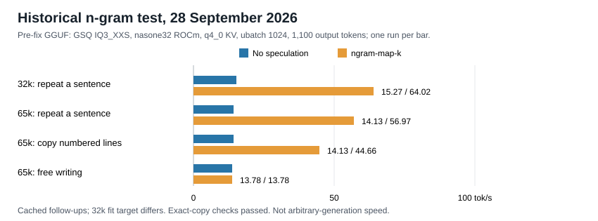
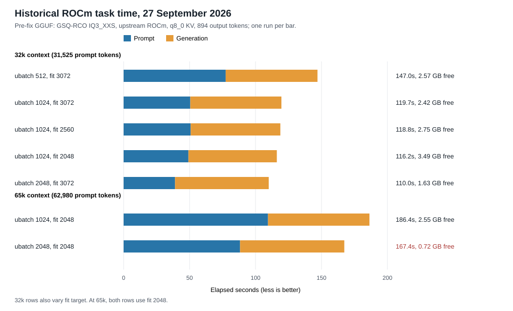
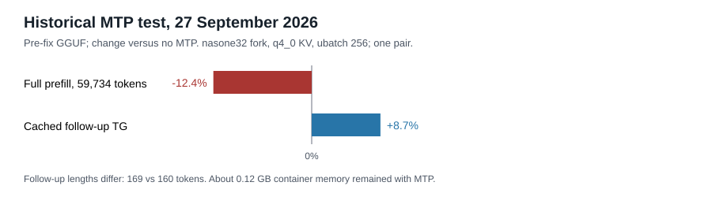

# Qwen3.8 Flash-Next on an RX 7900 XTX

Measurements from one 24 GB RDNA3 card with 32 GiB of host RAM, collected from 24 September to 3 October 2026. Two GGUF quantizations and one EXL3 quantization were tested; there was no common quality suite. Most configurations were run once.

## At a glance

**Historical GGUF caveat:** all GGUF results dated 27-29 September predate the upstream qwen4exp correctness fix #29751. They remain historical results and do not validate the fixed implementation. [2-3 October retest, MTP limits and q8_0 KV](reports/flashnext-gguf-qwen4exp-fix-2026-10-03.md).

- **Pi memory with the fixed GGUF build:** default context checkpoints drove anon growth to cgroup OOM while shmem stayed about 24.25 GiB. With `--ctx-checkpoints 4 --cache-ram 0`, q4_0 and q8_0 each completed 28 turns and two compactions, with minimum MemAvailable 2.928/1.866 GiB. Later q8_0 completed Pi growth to 60k, compaction, 5/5 recall and a tool turn, then direct 62,975/63,020-token requests, with minimum free RAM 1.514 GiB. The first 60,190-token attempt stopped on harness bookkeeping and is excluded from session validation. q4_0 leaves about 1 GiB more RAM in the matched sessions. Empty finals and wrong/empty long-thinking occur with both KV types; n=1 runs do not compare KV quality. No soak or production deployment. [Memory comparison, failed runs and both flag variants](reports/flashnext-gguf-pi-memory-2026-10-03.md)
- **GGUF after the qwen4exp fix:** upstream `bed0a856606e` with GSQ-RCO IQ3_XXS and the matched no-MTP profile reached 13.82 vs 12.83 TG tok/s at 32k and 12.41 vs 11.34 at 65k (n=1 each). The old build contained the qwen4exp correctness defect fixed by #29751; these differences compare upstream revisions and do not establish a speedup attributable to #29751. q8_0 KV completed 65k at 12.97 / 13.15 TG versus q4_0 12.41 / 12.58, with different fitted weight placements, so it does not isolate the effect of KV quantization. The tested pinned MTP configuration could not fit within the host-RAM safety budget: its forecast was about 2 GiB short of the required 3 GiB free-RAM floor. Acceptance was not measured. [New report and raw evidence](reports/flashnext-gguf-qwen4exp-fix-2026-10-03.md).

- **EXL3 2.50 bpw, Pi 32k validated with workarounds:** on 2 October, thinking medium and OFF completed 36/36 normal turns plus four expected HTTP 400 checks, with history, real read-tool round trips and a change of prefix. Prompts reached 28,462 tokens. `EXL3_BC_ATTN=0`, `-rcs 0.125` and three glibc allocator settings avoided the observed GPU fault and produced a short-run RAM plateau. Both exited naturally with code 0 using patched libhsa. Minimum MemAvailable was 3.779 GiB, but sampled free VRAM fell to 13.1 MiB. The fault still reproduces on clean fork main; the exact BC cause remains unknown. The profile is not deployed and has no multi-hour soak. [2 October measurements and limits](reports/flashnext-exl3-pi32k-stability-2026-10-02.md). Later that evening, with server cache = Pi window 43008, `-maxr 4096` and Pi `reserveTokens` 10240 (trigger 32768), Pi reached real prompts of 32,051 tokens with compaction: in two runs all 6 compactions in the normal flow succeeded (plus 1 of 2 in the over-window step), 5/5 facts were recalled at every check, minimum free VRAM was 267 MiB and TG was about 23.8 tok/s. One very large input (about 28k tokens at once) still left the session stuck in 1 of 2 runs because summaries hit the token cap. This profile is used only via the EXL3 wrapper, not the production llama.cpp launcher; it is not deployed and has no multi-hour soak. [Window and compaction results](reports/flashnext-exl3-pi-window-compaction-2026-10-02.md). [Earlier native fix and synthetic 32k/65k checks](reports/flashnext-exl3-native-fix-2026-09-30.md)

| EXL3 post-fix check | PP tok/s | TG tok/s | Scope |
| --- | ---: | ---: | --- |
| Direct 32k, input 31744 | 584.5-585.8 | 22.94-23.30 | OFF/ON, chunk 2048 |
| Direct 65k, input 64512 | 395.6-396.4 | 22.88-23.21 | OFF/ON, chunk 1024 |
| API 32k, input 30267 | 566.1 | 23.74 | one cold ON request |
| Pi 32k, medium, 2 October | 442.15 | 23.90 | request medians, PP n=10 / TG n=30; max prompt 28009 |
| Pi 32k, OFF, 2 October | 465.32 | 23.83 | request medians, PP n=10 / TG n=22; max prompt 28462 |
| Pi window 43008 + compaction, 2 October evening | 406.8-413.0 | 23.74-23.91 | two runs, Polish corpus; PP includes short prefills after compaction, not comparable; max real prompt 32051 |

The direct and API rows are single synthetic retrieval runs. Direct PP bypasses the API; chunk sizes and output lengths differ. The 2 October Pi rows use chunk 1024, PP on requests with more than 500 uncached tokens and TG on outputs of at least 20 tokens. Their medians are not a matched comparison with the earlier rows or a general quality benchmark. Pi now reached about 28.5k prompt tokens within a 32k window; the earlier 721-token smoke was only an allocation check. The earlier failed YAML comparison passed with a Python workaround but was not rerun after the native fix.

- **Historical q8_0 KV at 65k, 29 September OOM and recovery:** the ROCm profile with 32 expert-cache slots/layer and `fit-target=3072` passed one benchmark, then the 28 GiB container OOM-killed it during live use. A 12-slot profile with `fit-target=2048` completed one 65k run at 571 PP / 13.67 TG tok/s, peaking at 28.60 of 30.06 GB; multi-turn stability remains unproven. [Incident and recovery](reports/flashnext-q8-oom-recovery-2026-09-29.md). The [3 October completed q8_0 run](reports/flashnext-gguf-qwen4exp-fix-2026-10-03.md#q8_0-versus-q4_0-kv-at-65k) uses the fixed upstream build with no expert cache and a different profile.
- **Vulkan now completes 32k and 65k:** `--no-host --load-mode none --lazy-mode on` avoids the previous RADV load failure and disk-heavy `mmap` path. At 65k it reached 113 PP / 14.30 TG tok/s, with no OOM or swap; the whole request took 635.9 s versus 181.8 s for the ROCm cache-32 profile. Experimental expert cache on Vulkan produced incorrect text in a short check. [Fix and evidence](reports/flashnext-vulkan-nohost-2026-09-29.md)
- **Experimental expert cache on ROCm:** on a matched build, 65k free-text TG rose from 11.46 to 15.76 tok/s with 32 cache slots per layer; 48 slots reached 16.20 with less memory margin. The 20 tok/s goal remains unmet. At 32k, 32 slots reached 18.19 TG but touched the container RAM limit. [Measurements and caveats](reports/flashnext-expert-cache-rocm-vulkan-2026-09-29.md)
- **New 32k and 65k GSQ results:** nasone32's ROCm fork with q4_0 KV, `ubatch=1024`, and `ngram-map-k` reached 617 PP / 14.89 free-text TG / 64.02 exact-copy TG tok/s at 32k, and 510 PP / 13.78 free-text TG / 56.97 exact-copy TG at 65k. The copy task repeated text from the prompt. For free writing, the 20 TG tok/s goal remains unmet. [Full comparison and limits](reports/flashnext-32k-65k-benchmarks-2026-09-28.md)
- **Historical 32k fixed MTP, before the correctness fix:** n=1, 2, and 3 reached 14.82, 16.14, and 13.53 free-text TG tok/s. n=3 used 1.57 GB of swap and left only 0.13 GB beneath the RAM limit. None improved the full request over the preferred no-MTP profile. These older numbers do not establish a usable MTP option on `bed0a856606e`; the [new-build attempts and budget](reports/flashnext-gguf-qwen4exp-fix-2026-10-03.md#mtp-memory-budget-and-failed-alternatives) failed the resident-memory requirement. [Matched 32k results](reports/flashnext-32k-65k-benchmarks-2026-09-28.md)
- **GSQ-RCO IQ3_XXS, upstream ROCm:** a 62,980-token prompt and 894-token answer took 186.4 s at `ubatch=1024`, leaving 2.55 GB inside the container limit. `ubatch=2048` took 167.4 s but left 0.72 GB. [Settings and raw runs](docs/rocm-tuning.md)
- **Earlier 65k MTP, different fork and settings:** cached generation gained 8.7%, while full prefill lost 12.4%. The MTP run left about 0.12 GB of container memory. These are historical numbers, not a usable MTP option on the new build; [resident-memory limits and the rejected streaming path](reports/flashnext-gguf-qwen4exp-fix-2026-10-03.md#mtp-memory-budget-and-failed-alternatives) prevented an acceptance measurement. [Paired test](docs/mtp.md)
- **AtomicChat IQ4_XS:** upstream HIP completed one 63k-token thinking task at 9.33 generated tok/s; the tested `nasone32` HIP build produced incoherent text on short prompts. [Backend checks](docs/correctness.md)

The new chart compares cached follow-ups; the 32k pair also differs in fit target. The [28 September report](reports/flashnext-32k-65k-benchmarks-2026-09-28.md) includes full-prompt speed, memory peaks, exact-copy checks, and the MTP memory limit.

## ROCm task time

The bars show elapsed time for one 894-token answer, split into prompt processing and generation. At 32k, `fit-target` also varies, so those rows do not isolate `ubatch`. The two 65k rows both use `fit-target=2048`. Each bar is one run, with no error range. [All rates, memory readings, and raw records](docs/rocm-tuning.md)

## Historical MTP at 65k, separate setup

The chart and pair below predate the qwen4exp correctness fix. On `bed0a856606e`, the tested pinned MTP configuration could not fit within the host-RAM safety budget (forecast about 2 GiB short of the required 3 GiB free-RAM floor); `--no-host` streamed weights from NVMe and never reached useful generation. Acceptance was not measured. [New-build evidence](reports/flashnext-gguf-qwen4exp-fix-2026-10-03.md#mtp-memory-budget-and-failed-alternatives).

| Measure | No MTP | MTP n=1 |
| --- | ---: | ---: |
| Full prefill of 59,734 tokens | 278.10 PP tok/s | 243.54 PP tok/s |
| Cached follow-up | 14.52 TG tok/s, 169 tokens | 15.78 TG tok/s, 160 tokens |
| Container memory free after follow-up | about 4.19 GB | about 0.12 GB |

This pair used the `nasone32` fork, q4_0 KV, and `ubatch=256`, unlike the ROCm chart. The memory values come from the [historical report](reports/qwen-gsq-nasone32-mtp-2026-09-27.md); the speed values come from [four response records](docs/mtp.md#controlled-65k-pair). Different follow-up lengths and a single pair limit the speed claim.

## Other findings

- AtomicChat IQ4_XS answered four short prompts correctly under upstream HIP and Vulkan; one upstream HIP 63,081-token arithmetic thinking request completed at 9.33 TG tok/s after a 365.8 s cold prefill. The tested `nasone32` HIP build gave incoherent short answers. This does not identify a faulty commit. [Correctness](docs/correctness.md) and [context](docs/context-and-memory.md)
- GSQ Vulkan `mmap` loaded a 65k window but did not finish a fresh 31.5k-token prompt in a useful time. ROCm used a different loading mode, so this is not a clean GPU API comparison. [Vulkan details](docs/vulkan.md)

## What was checked

Text generation, a few arithmetic questions with and without thinking, retrieval of a marker near the end of a long synthetic prompt, one two-shape image, and one `multiply` tool call. The 65,536-token context window loaded; successful prompts reached roughly 63k tokens. No prompt longer than 65k was tested. See [correctness](docs/correctness.md) and [context and memory](docs/context-and-memory.md) for the exact cases.

The quantizations were not run through a common quality suite. The initial 30 September EXL3/GGUF comparison covered one short tool-result task; later EXL3 checks added a gate-kernel oracle, 24 short API cases, six Pi read round trips at 8k and synthetic retrieval at 32k/65k after a native fix. These measurements cannot rank their quality or extrapolate the tested throughput to other cards, concurrent users, or arbitrary 65k conversations.

## Read and verify

- [Setup](docs/setup.md): model identities, build pins, memory limits.
- [Methodology](docs/methodology.md): how PP/TG and cached prompts were interpreted.
- [Correctness](docs/correctness.md), [context and memory](docs/context-and-memory.md), [ROCm tuning](docs/rocm-tuning.md), [MTP](docs/mtp.md), [Vulkan](docs/vulkan.md): findings with raw-file links and caveats.
- [Data guide](data/README.md): 316 selected evidence files (75 older, 80 from 28 September, 17 expert-cache records, 4 Vulkan repair records, 8 q8_0 KV records, 23 initial EXL3 records, 20 EXL3 fix/check records, 6 EXL3 stability summaries, 4 EXL3 window/compaction summaries, 25 GGUF fix/MTP/q8_0 records and 54 GGUF Pi memory records) plus SHA-256 manifest. [Historical reports](reports/) retain the original field notes with local paths anonymized; their service status is historical. The [OOM and recovery report](reports/flashnext-q8-oom-recovery-2026-09-29.md) covers the later q8_0 profile changes.

Run `python3 scripts/data.py check` to validate the selected data, manifest, JSON syntax, and basic private-path scan. This does not run the models. Model weights and full server/build logs are excluded.

Run `python3 scripts/charts.py --check` to verify that the ROCm and MTP charts match the selected raw records. Run without `--check` to regenerate those two charts. The n-gram chart was drawn from the values in the 28 September report and is not checked by the script. The chart script checks recorded timings, but cannot reproduce or validate the inference runs.

The neighboring [Qwen3.8-27B tuning repository](https://github.com/szafranski/rx7900xtx-llm-tuning) inspired the evidence-first format. Its numbers are for a different model and workload.

No license has been chosen for this repository yet.
